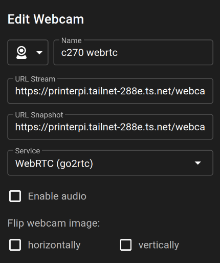

From when I first upgraded my 3D printer to use Octoprint in 2020 one part of the setup that has been essential has been the ability to monitor and control my printer remotely. Initially I used a seperate Raspberry Pi 3b+ with a USB webcam streaming over octoprint's mjpeg streamer. This worked well for a while but the quality was limited to 640x480 and the frame rate was low, making it hard to see fine details of the print. 

After several printer hardware and software updates I decided to look for a better solution.

By default the Mainsail 3D printer web interface (which I use with Klipper) integrates with most popular streaming methods like MJPEG, IP Cameras and WebRTC. In order to provide this stream through it needed a seperate piece of software installed that would handle the camera input and broadcast it in a compatible format. The Mainsail project reccomends their own software called crowsnest which is a simple piece of software optimised for use with Raspberry Pi and their integrated VPU (Video Processing Unit). Whilst this software worked well I wanted something that was more configurable and would take up less space on the limited (8GB) eMMC of the Raspberry Pi CM4 I was using.

Because of the way Mainsail and Moonraker (the API backend for Klipper) are designed to support updating and installing additional software they require cloning the source code and compiling it on the device. This isn't ideal for a device with already limited resources. Additionally Crowsnest relies on both the `camera-streamer` and `ustreamer` projects and includes their source massively increasing the size of the install.

The solution that I found to this was to use [go2rtc](https://github.com/AlexxIT/go2rtc), a program designed to translate between different streaming protocols. It supports a wide range of input sources including USB cameras, RTSP streams, and even MJPEG streams. It can then output these streams in various formats as well, including WebRTC which is what Mainsail supports natively.

The benefit of using go2rtc however is that it is a single binary file that can be downloaded and run directly on the Raspberry Pi CM4 without needing to compile anything. This makes it much easier to install and manage. Additionally it supports a wide range of configuration options allowing for fine tuning of the stream quality and performance. Additionally it supports the Raspberry Pi's VPU for hardware encoding which is essential for maintaining good performance on the limited hardware without overloading the CPU which is also running Klipper and Mainsail.

It is worth keeping in mind that in order to encode and decode video into the correct formats for streaming over WebRTC in h264 ffmpeg also needs to be installed on the device. This can be done easily through the package manager on most Linux distributions. And whilst it does take up some space it is a widely used tool and is likely to be useful for other tasks as well.

There are a couple steps to setup go2rtc with Mainsail on Raspberry Pi OS:

1. Download the latest release of go2rtc from the [releases page](https://github.com/AlexxIT/go2rtc/releases) and extract the binary to a suitable location on your Raspberry Pi CM4. I placed mine in `/usr/local/bin` so that it is available system wide.
2. Create a service file for go2rtc so that it can be managed by systemd. This allows it to start automatically on boot and be easily restarted if needed. Create a file at `/etc/systemd/system/go2rtc.service` with the following content:

    ```ini
    [Unit]
    Description=go2rtc -  Ultimate camera streaming application with support RTSP, RTMP, HTTP-FLV, WebRTC, MSE, HLS, MP4, MJPEG, HomeKit, FFmpeg, etc.
    Documentation=https://github.com/AlexxIT/go2rtc
    After=udev.service network-online.target nss-lookup.target
    Wants=udev.service network-online.target
    StartLimitBurst=10
    StartLimitIntervalSec=180

    [Install]
    WantedBy=multi-user.target

    [Service]
    Type=simple
    User=sebas
    RemainAfterExit=Yes
    WorkingDirectory=/home/sebas/
    ExecStart=/usr/local/bin/go2rtc
    Restart=on-failure
    RestartSec=5
    ```

    > Make sure to replace `sebas` with your actual username and adjust the `WorkingDirectory` if needed.

3. Reload the systemd daemon to recognize the new service and start it:

    ```bash
    sudo systemctl daemon-reload
    sudo systemctl enable --now go2rtc
    ```

4. Configure go2rtc for your hardware. This can be done using the web interface (available at `http://<your-raspberry-pi-ip>:1984`) or by creating a configuration file at `/home/sebas/go2rtc.yaml`. Here is the configuration that I'm using for my setup:

    ```yaml
    treams:
    c270:
        - ffmpeg:device?video=/dev/video0&input_format=yuyv422&video_size=1280x960&framerate=15#video=h264#hardware=v4l2m2m

    webrtc:
        candidates:
            - <tailscale IP>:8555
    ```

    > Make sure to replace `<tailscale IP>` with the virtual IP address of your Raspberry Pi on your Tailscale network if you are using Tailscale for remote access. (This is optional but recommended for secure remote access.)

5. Finally, configure Mainsail to use the go2rtc stream. 
    

    The URL that I used is specific to my reverse proxy setup but the format is generally as follows:

    `http://<printer ip>:1984/webrtc.html?camera=c270`

With this setup I am able to monitor my 3D printer in real-time with a high quality stream that is both low latency and high resolution. The use of go2rtc has allowed me to avoid the need for additional software installations and has provided a more flexible and configurable solution for my 3D printing needs. It also has the added benefit of being lightweight and efficient, making it ideal for use on a Raspberry Pi CM4 alongside other essential software like Klipper and Mainsail.

<!-- Over time I upgraded my 3D printer's hardware to the BigtreeTech Manta E3EZ board (a drop in replacement for the Ender 3) which, with the help of some online models was easy to use with a CR-10. The best feature of this board is that it has support for adding a Raspberry Pi Compute Module 4 (CM4) directly to the board, allowing for a more integrated solution.   -->